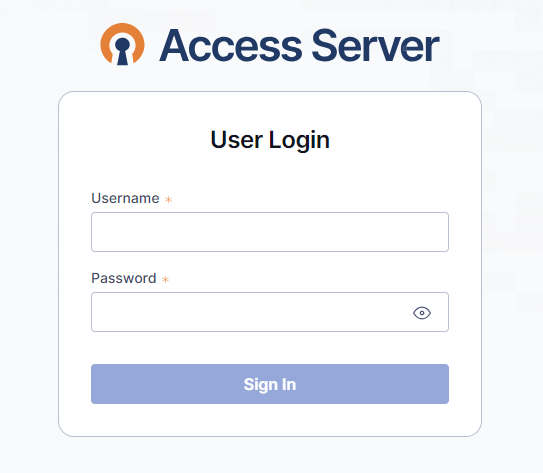
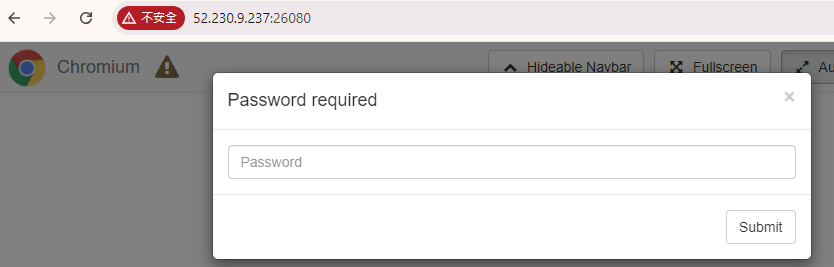
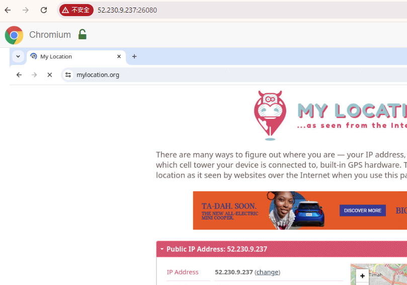

#  
Demostration deploy Azure VM with Cloud-init and fastly deploy OpenVPN and noVNC.

## Features
* OpenVPN 
* noVNC with Chrome
* Azure VM

# How to use 

* Open you Azure Cloud shell and download this repo. 

```
git clone https://github.com/kenszeapp/demo_azure_vm_cloud_init.git

cd demo_azure_vm_cloud_init

chmod +wx ./create.sh
```

## Modify the varibles like VM_RG, VM_NAME etc.

```
nano ./create.sh
```

## Deploy VM
```
./create.sh
```

# After Deployemnt done, How to access services.

## OpenVPN  
OpenVPN web admin : 52.230.9.237:943   (replace your VM IP)

User: openvpn
password: lWwigLZKnU0a
```
cd /tmp
docker-compose logs openvpn-as | grep "Auto-generated"
```
**the VPN client setup is not intended in this demo. Visit OpenVPN offical website.**


## VNC 
http://52.230.9.237:26080 (replace your VM IP)
Password: Password!!   (can change VNC_PASS in docker-compose.yaml)




## Clean up resourse 
`az group delete --name YourResourceGroupName --yes`


## Notes for myself

* The cloud init cannot use relative path. For example, curl download file cannot save to ~/docker-compose.yaml

* Useful 
```
# Replace YourResourceGroupName with the actual name
rg_name="YourResourceGroupName"

# Get all resource IDs in the resource group
resource_ids=$(az resource list --resource-group "$rg_name" --query "[].id" --output tsv)

# Loop through each resource and delete it
while IFS= read -r resource_id; do
    az resource delete --ids "$resource_id" --yes
done <<< "$resource_ids"

# List items under resourse group
az resource list --resource-group "$rg_name" --query "[].{Name: name, Type: type}" --output table

# Check log for cloud-init (Run Inside VM)

sudo tail -100 /var/log/cloud-init.log

```

